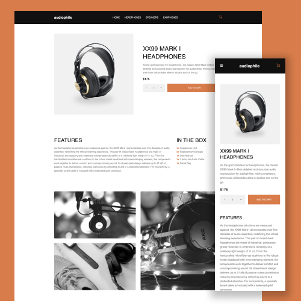

# Audiophile Ecommerce - VUE + Drupal

Audiophile is an ecommerce demo built using Vue 3 and Drupal RESTful API. Developed and deployed a high fidelity ecommerce website originally desigend by [Frontend Mentor](https://www.frontendmentor.io/) from a Figma Mockup.

## Built With

- Vue 3
- Drupal RESTful API
- Mobile First Development
- Figma Design Tools
- Composition API
- Local Storage

### Screenshot

Screenshot of deployed site:

